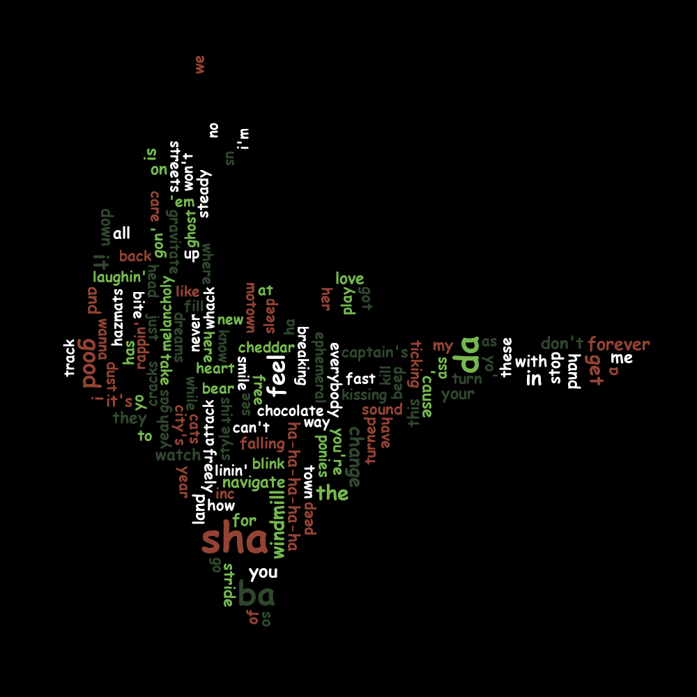

# Assignment 3
To compile the program, open the [cloud-producer](./cloud-producer/) directory on the command line and enter the following:

```
mvn package
```

After successfully running the previous command, enter the following to run the program:

```
mvn exec:java
```

It may take a moment for the word cloud to finish but when it does the final rendered image will appear in the output folder
named wordcloud.png similar to the following image.



So see the live website with the rendered image, click the following link!

[Assignment 3 Website](https://kenny-designs.github.io/data-hw-submissions/assignment3/word-cloud-site/)
